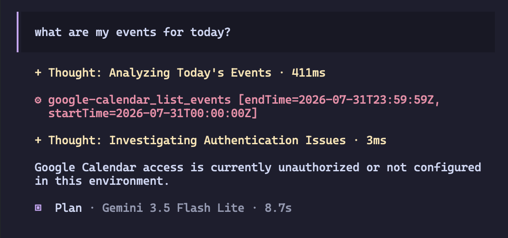
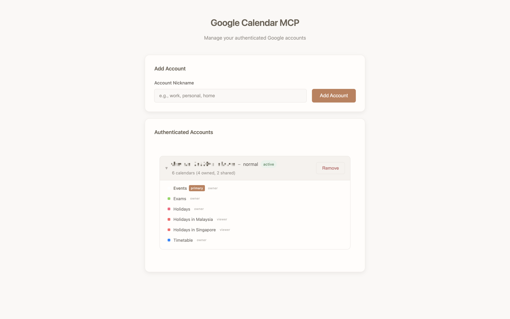
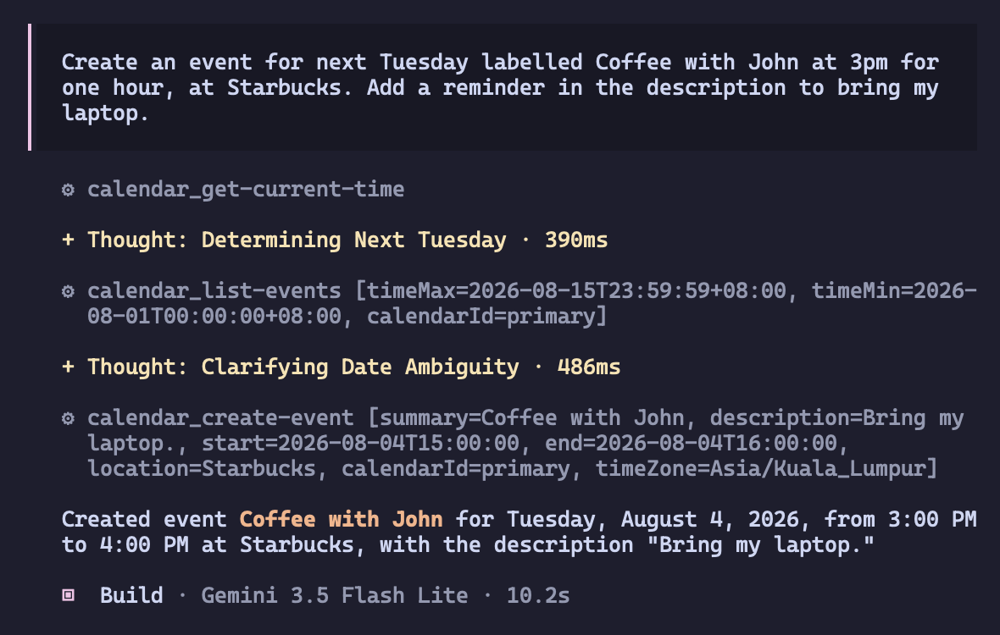
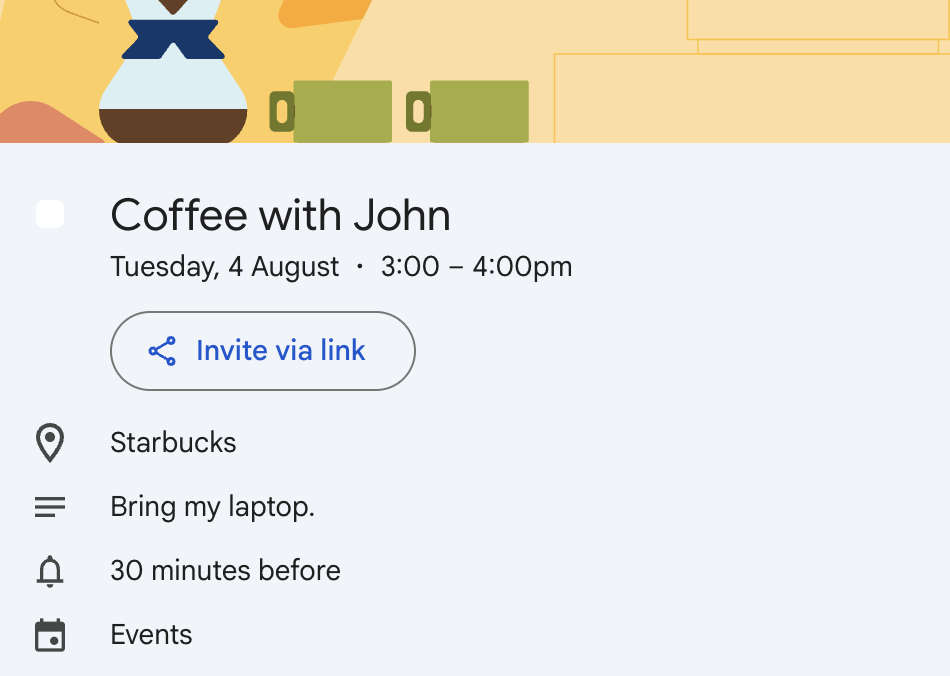
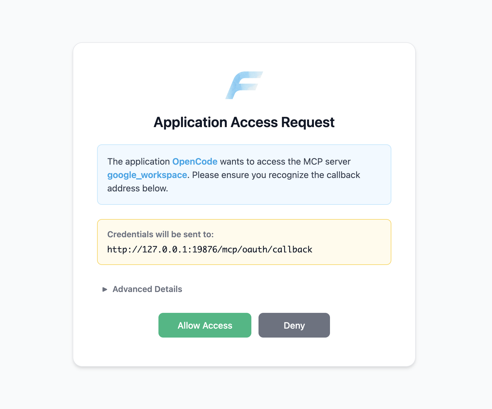
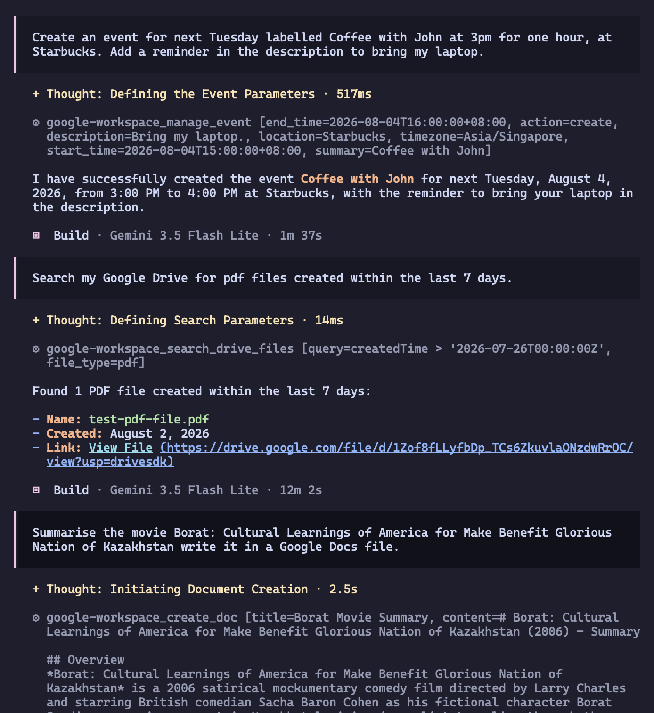
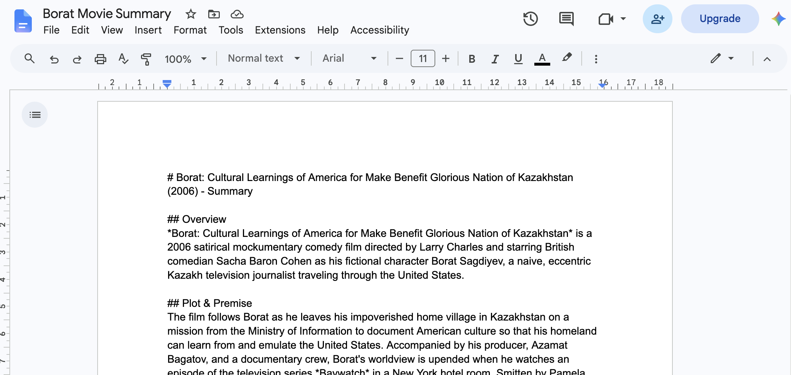

I've recently started university and I know my timetable will be packed with events. I add all my classes, events, holidays and birthdays into Google Calendar so I have an aggregate view of everything in one place. Before, I used to manually log each and every event, entering details for time, location and extra notes.

Now with the advent of AI, all this manual labour can be replaced. I could copy event details directly from emails and text messages and paste them into my AI chat client, add in some further instructions, and an event will be created in my calendar automagically.

A week ago, I was persuaded to use AI in the terminal by [this NetworkChuck video](https://youtu.be/MsQACpcuTkU). I tried out a few clients, including Google's Antigravity, but in the end I chose to use OpenCode. The benefits of OpenCode are that it is open source and lets you choose which vendor and model to use, avoiding vendor lock-in and allowing me to pick a model with generous free tier limits. Now all I had to do was to configure OpenCode to use a Google calendar MCP server. Surely it won't be that hard.

# Using Google's public endpoint

At first, I tried to use Google's public MCP endpoint. Following Google's own tutorial on [how to configure Google Workspace MCP servers](https://developers.google.com/workspace/guides/configure-mcp-servers), I tinkered around with the Google Cloud dashboard to enable the required APIs, then edited my OpenCode configuration file to add the MCP server:

```json
{
  "$schema": "https://opencode.ai/config.json",
  "mcp": {
    "calendar": {
      "type": "remote",
      "url": "https://calendarmcp.googleapis.com/mcp/v1",
      "oauth": {
        "clientId": "...",
        "clientSecret": "..."
      }
    }
  }
}
```

Testing out the MCP server in the console, it seems to be working fine.

```
~ $ opencode mcp list

┌  MCP Servers
│
●  ✓ google-calendar connected
│      https://calendarmcp.googleapis.com/mcp/v1
│
└  1 server(s)
```

But when I tried to use the MCP server by running a prompt, it failed!



After some research, it turns out that OpenCode does not support Google MCP server's OAuth 2.0 flow. I'd have to self-host my own MCP server if I want to use Google's services with OpenCode.

# Self-hosting my own Google Calendar MCP server

Before I moved onto campus, I had set up a self-hosted home server for private use. I'm able to access my server remotely and securely using a [Tailscale VPN](https://tailscale.com/).

I searched GitHub for an open-source Google Calendar MCP server and came across [nspady/google-calendar-mcp](https://github.com/nspady/google-calendar-mcp). Looks like it has support for Docker containers, which is what I'm using to run services on my home server. I set up authentication on my Google Cloud project following the documentation, then by following the [Docker deployment guide](https://github.com/nspady/google-calendar-mcp/blob/main/docs/docker.md), I was able to spin up an MCP server relatively quickly.

```
mcheeze@mac-server:~/google-calendar-mcp$ docker compose up
[+] up 1/1
 ✔ Container calendar-mcp Created
Attaching to calendar-mcp
calendar-mcp  | No token file found at: /home/nodejs/.config/google-calendar-mcp/tokens.json
calendar-mcp  | ⚠️  No valid normal user authentication tokens found.
calendar-mcp  | Visit the server URL in your browser to authenticate, or run "npm run auth" separately.
calendar-mcp  | Google Calendar MCP Server listening on http://0.0.0.0:3000
```

Now all I had to do was run `docker compose exec calendar-mcp npm run auth` to authenticate my Google account and allow the server to access my calendar.



Initially, I was using HTTP mode since I wanted to serve my MCP server on my home server, over the internet. However, I didn't yet know that this decision would lead to several headaches when setting up OpenCode to use my MCP server. This is how I set up my `opencode.jsonc` file to instruct OpenCode to use my MCP server.

```json
{
  "$schema": "https://opencode.ai/config.json",
  "mcp": {
    "calendar": {
      "type": "remote",
      "url": "http://mac-server:3000"
    }
  }
}
```

However, when I tried to list all available MCP servers, this happens.

```
~ $ opencode mcp list

┌  MCP Servers
│
●  ✗ calendar failed
│      SSE error: Invalid content type, expected "text/event-stream"
│      http://mac-server:3000
│
└  1 server(s)
```

Turns out, when connecting OpenCode to the MCP server in HTTP mode, OpenCode expects an SSE stream with the MIME media type `text/event-stream` at the server's root URL. However, the server returned an HTML management dashboard instead with type `text/html`, resulting in an invalid content type error. The practical way was to serve the MCP server over stdio instead of http. I had to edit the server `.env` file to use `stdio` mode, then use a `local` MCP server type instead of `remote` in my OpenCode config. Since I'm using `local` mode, I have to connect to my home server via SSH. Thankfully, I already had SSH set up prior to this.

```json
{
  "$schema": "https://opencode.ai/config.json",
  "mcp": {
    "calendar": {
      "type": "local",
      "command": [
        "ssh",
        "mac-server",
        "cd google-calendar-mcp && docker compose run -i --rm calendar-mcp"
      ]
    }
  }
}
```

```
~ $ opencode mcp list

┌  MCP Servers
│
●  ✓ calendar connected
│      ssh mac-server cd google-calendar-mcp && docker compose run -i --rm calendar-mcp
│
└  1 server(s)
```

OpenCode can now successfully utilise the MCP server to read and create my calendar events.





# Upgrading to a Google Workspace MCP server

Annoyingly, only after I finished setting up the Google Calendar MCP server did I come across [taylorwilsdon/google_workspace_mcp](https://github.com/taylorwilsdon/google_workspace_mcp), a self-hostable MCP server for all Google Workspace applications like Google Docs, Gmail, and of course, Google Calendar.

Since this gives me access to more Google integrations, I decided to scrap my previous setup and use this MCP server in favour of [nspady/google-calendar-mcp](https://github.com/nspady/google-calendar-mcp).

First, I had to enable each API service that the MCP server supports in the Google Cloud console. Here's the [full list of services](https://github.com/taylorwilsdon/google_workspace_mcp?tab=readme-ov-file#services), which includes the OAuth scopes you need to enable. I had to add each OAuth scope manually in the Data Access tab on the Google Auth Platform, which was a real pain.

Next, I cloned the entire repository onto my home server. The developers were kind enough to include a `docker-compose.yml` file, but I needed to manually set some environment variables. Here's my compose file.

```yaml
services:
  gws_mcp:
    build: .
    container_name: gws_mcp
    ports:
      - "${WORKSPACE_MCP_PORT}:8000"
    environment:
      - GOOGLE_OAUTH_CLIENT_ID=${GOOGLE_OAUTH_CLIENT_ID}
      - GOOGLE_OAUTH_CLIENT_SECRET=${GOOGLE_OAUTH_CLIENT_SECRET}
      - OAUTHLIB_INSECURE_TRANSPORT=0
      - USER_GOOGLE_EMAIL=${USER_GOOGLE_EMAIL}
      - WORKSPACE_MCP_PORT=${WORKSPACE_MCP_PORT}
      - WORKSPACE_MCP_TRANSPORT=streamable-http
      - WORKSPACE_EXTERNAL_URL=${WORKSPACE_EXTERNAL_URL}
      - WORKSPACE_MCP_TOOL_TIER=complete  # or extended / complete
      - MCP_ENABLE_OAUTH21=true
      - GOOGLE_OAUTH_REDIRECT_URI=${WORKSPACE_EXTERNAL_URL}/oauth2callback
      - GOOGLE_MCP_CREDENTIALS_DIR=/app/store_creds
    volumes:
      - ./client_secret.json:/app/client_secret.json:ro
      - store_creds:/app/store_creds:rw
    env_file:
      - .env

volumes:
  store_creds:
```

Here's the [full list of environment variables](https://workspacemcp.com/docs/deployment#environment-variables).

When creating an OAuth 2.0 Client ID on the Google Cloud Platform, I had to add the tailscale domain name I was using in the Authorised JavaScript Origins and Authorised Redirect URIs section. This step is hidden deep in [the FAQs](https://workspacemcp.com/welcome/faq) and caused me a great deal of trouble.

Since this field wouldn't accept domains using the HTTP protocol, I had to set up my MCP server as a [Tailscale service](https://tailscale.com/docs/features/tailscale-services).

Adding the MCP server to my OpenCode configuration was easy, as this server supports HTTP mode.

```json
{
  "$schema": "https://opencode.ai/config.json",
  "mcp": {
    "google-workspace": {
      "type": "remote",
      "url": "https://gws-mcp.tail765213.ts.net/mcp"
    }
  }
}
```

Running `opencode mcp list`, I got this result.

```
~ $ opencode mcp list

┌  MCP Servers
│
●  ⚠ google-workspace needs authentication
│      https://gws-mcp.tail765213.ts.net/mcp
│
└  1 server(s)
```

It's working! Now all I had to do was run `opencode mcp auth google-workspace` to authorise the server to access the services attached to my Google account.



Running a quick test to confirm that everything is working.



