Out of all major cloud hosting providers, Oracle Cloud Infrastructure (OCI) provides the most generous free tier. You can run a virtual machine with 24 GB of memory at no cost, provided you don't exceed the free tier limits.

Here's a breakdown of the [free tier usage limits](https://docs.oracle.com/en-us/iaas/Content/FreeTier/freetier_topic-Always_Free_Resources.htm) for an Arm Compute Instance:

- 4 OCPUs per month. (An OCPU is a physical processor core.)
- 24 GB of RAM across all instances.
- 200 GB of storage.
- 10 TB of outbound data (egress) per month.

Very generous. Thanks Larry Ellison.

To simplify things, we'll be running our Minecraft server on a Docker container to avoid having to set up the server manually. Don't worry if you're not familiar with Docker, I'll explain things as we go.

# Signing up for an Oracle Cloud account

Head over to [signup.cloud.oracle.com](https://signup.cloud.oracle.com) and register a free account. You will need a credit card for this, and you will be charged temporarily, but the charge will be refunded.

You can now start using OCI services for free, but you might run into an `Out of capacity` error while creating a new Compute Instance. Oracle only allocates a limited amount of instances for Always Free accounts, so if all resources are being used at the moment, you will need to wait for them to be reclaimed. You can bypass this by upgrading your account to [Pay As You Go (PAYG)](https://www.oracle.com/asean/industries/payg-services-price-list/). You will still have access to the free tier with a PAYG account, so you don't ever have to pay anything unless you accidentally exceed the free tier usage limits. Very sneaky, Larry Ellison.

On the cloud dashboard, click on the navigation menu and head over to `Billing & Cost Management > Upgrade and Manage Payment`. There should be an option to upgrade your account.

# Setting up the infrastructure

## Creating a compartment

Before creating a Compute Instance, you must first create a [compartment](https://docs.oracle.com/en/cloud/foundation/cloud_architecture/governance/compartments.html). A compartment is simply a group of OCI resources. Head over to `Identity & Security > Compartments`. Create a compartment with your root compartment as the parent, and name it whatever you want. I'll name mine "minecraft".

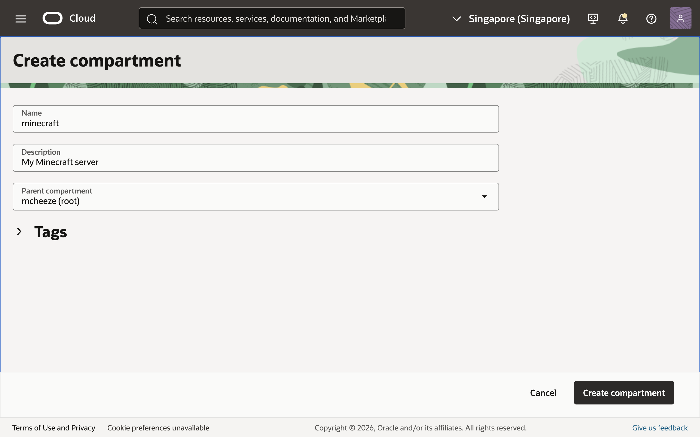

## Creating a Virtual Cloud Network

We need to create a Virtual Cloud Network so that we can create our instance inside of it. Go to `Networking > Virtual Cloud Networks` and click "Create VCN". Name your VCN something like "minecraft-network" and select the compartment that you have created. Add an IPv4 CIDR block to specify the range of IP addresses that devices in the network will use. I'll enter `10.0.0.0/16` to target the addresses `10.0.0.0`-`10.0.255.255`.

> [!info] CIDR blocks
> A CIDR block represents a range of IPv4 addresses. Each number in the address is 8 bits long and the suffix (e.g. `/16`) is the network mask that indicates how many bits are dedicated to the network prefix. For `10.0.0.0/16`, the first 16 bits (`10.0`) is the network prefix, while the remaining 16 bits are reserved for host addresses.

Keep the other settings as is and create the VCN.

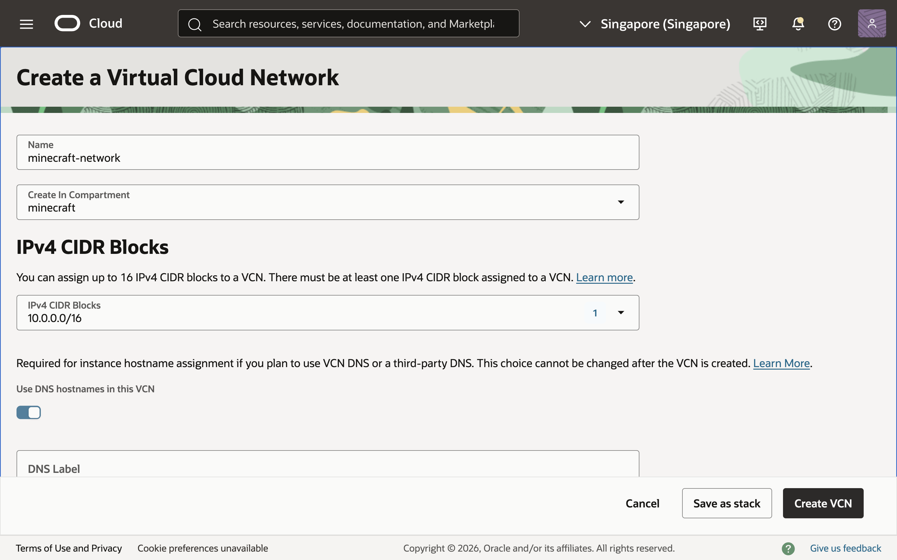

Next, create a public subnet within the VCN so that our Compute Instance will have a public IP address. Head to the "Subnets" tab. Create a subnet in your compartment and assign it a name. I'll name my subnet "minecraft-subnet". Add an IPv4 CIDR block for the subnet. I'll enter `10.0.0.0/24` to target the addresses `10.0.0.0`-`10.0.0.255`. Make sure "Subnet Access" is set to "Public Subnet" and leave the other settings as is.

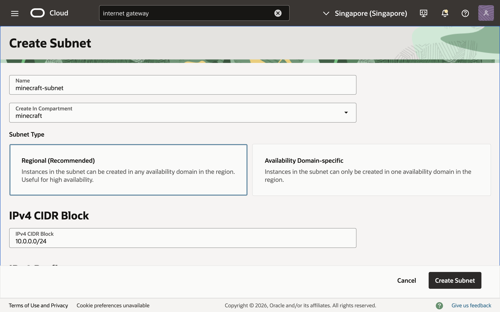

To allow the VCN to connect to the internet, we must create an internet gateway. Head to the "Gateways" tab and scroll down to the "Internet Gateways" section. Create an internet gateway. I'll name mine "minecraft-internet-gateway". Leave the advanced options as is.

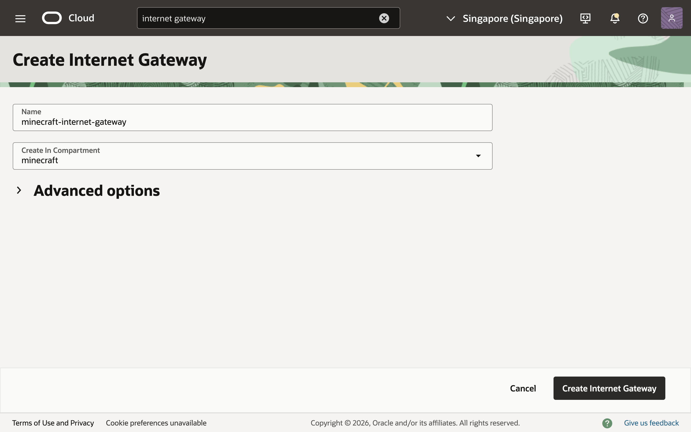

We must now create a route rule in the VCN's route table to direct traffic to our internet gateway. Head to the "Routing" tab and select the default route table. Go to the "Route Rules" tab and add a new route rule. Select "Internet Gateway" as the target type and set the destination CIDR block to `0.0.0.0/0` to direct all IP addresses to our internet gateway. Select the internet gateway you just created and add the route rule.

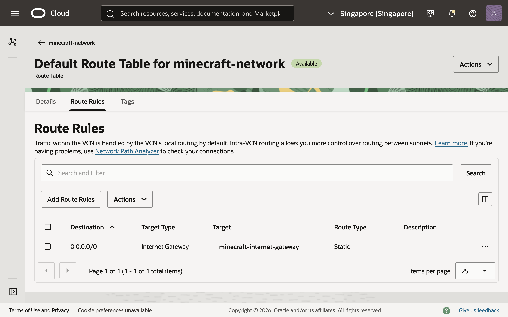

## Creating the Compute Instance

Now that the network is set up, we can create our Compute Instance. This is the virtual machine that will actually host our Minecraft server. Go to `Compute > Instances` and click on "Create Instance". I'll name my instance "minecraft-server".

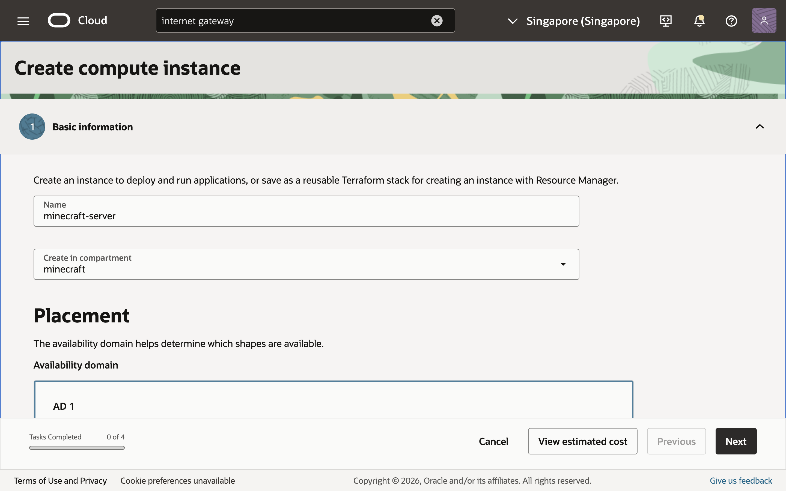

We'll be using Ubuntu for our instance. Scroll down to the "Image" section and change the image to Ubuntu. Select the latest available version of Canonical Ubuntu. I'm using Canonical Ubuntu 20.04.

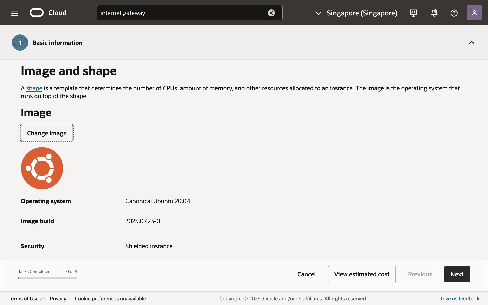

Scroll further to the "Shape" section and change the shape series to "Ampere" and the shape name to "VM.Standard.A1.Flex". This is the shape that is eligible for the free tier usage limits I mentioned at the beginning of this guide.

Click on the arrow beside the shape name to change the number of OCPUs and amount of memory for the shape. Since Minecraft is primarily single-threaded, we only need 2 OCPUs, one for the core game thread, and another to handle other background tasks. For the amount of memory, allocate 1 GB more than the amount you want the Minecraft server to run on. I want my server to run on 8 GB of memory, so I'll allocate 9 GB to my shape. The remaining 1 GB will be used by the OS to run any background system tasks.

> [!warning]
> Avoid allocating too much memory for your Minecraft server. It seems counterintuitive, but too much memory may cause lag spikes because Java's garbage collector will take longer to clear the large blocks of memory.

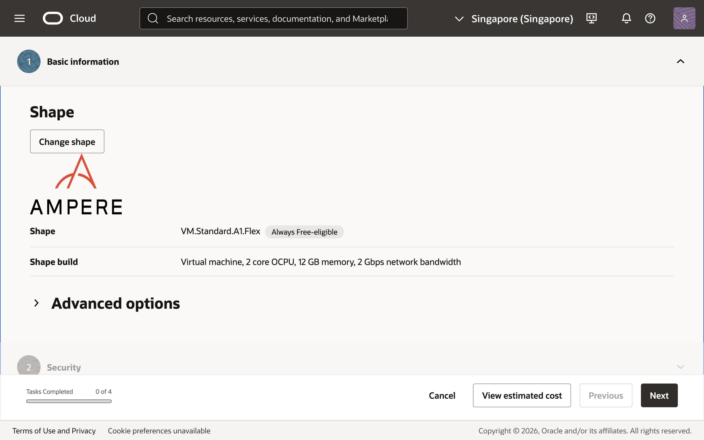

Click next and leave the security settings as is. 

Click next again to reach the "Networking" section. Select the VCN and subnet created in the previous step. Scroll to the bottom and download the private SSH key. I'll rename my key to `minecraft.key`.

> [!warning]
> Keep your key safe! Anyone with access to the private key will have access to your Compute Instance. Make sure to download the private key now as you won't get to see it again.

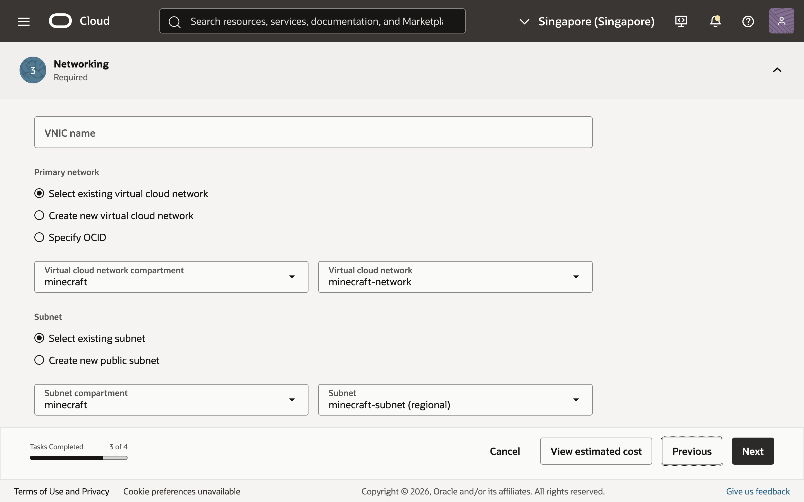

Click next to reach the "Storage" section. We'll attach a block volume to our instance to store our world files. A block volume is simply a virtual disk to store persistent files. Using block volumes, you can configure Oracle Cloud to automatically create backups for the entire volume if you need to.

Click "Attach block volume" and select the option to create a new block volume. I'll name mine "world-data". Scroll down to the "Volume size and performance" section. Select "Custom" and change the size of the volume. I'll set mine to 50 GB. Oracle provides you with 200 GB of free storage. This includes all your boot volumes and block volumes. Every instance comes with a boot volume of 50 GB, so the maximum size you can set your block volume to while not exceeding the free tier limits is 150 GB. I'll set it to 50 GB to leave some space for creating backups. Leave the other settings as is and create your block volume.

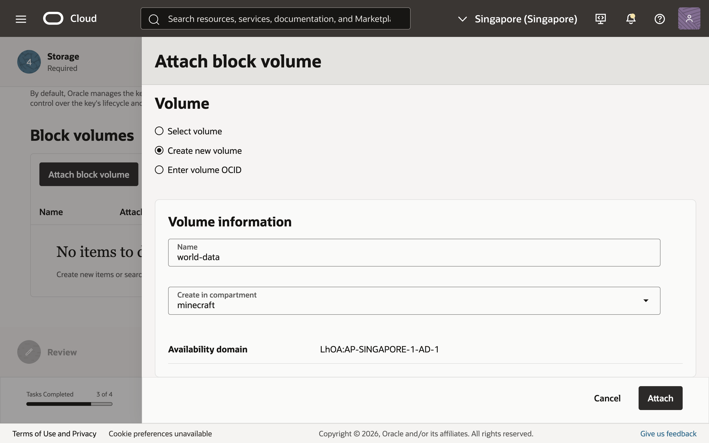

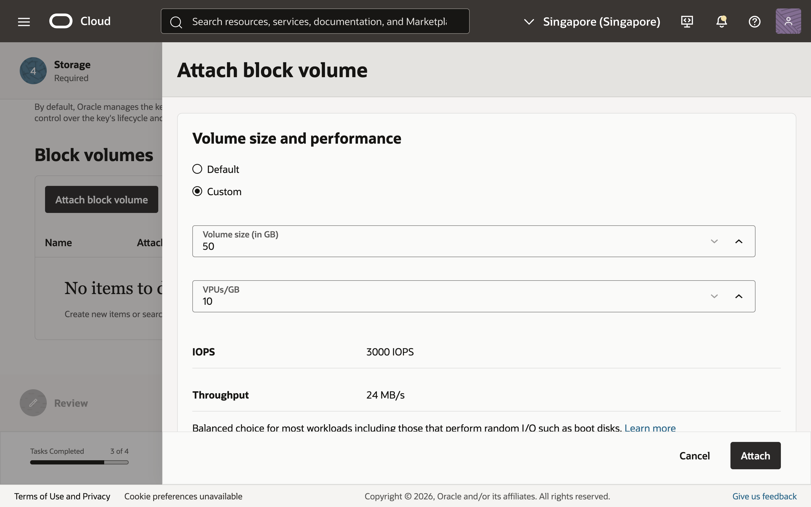

You can now finish creating your Compute Instance.

# Connecting to the virtual machine

We'll use SSH to connect to our virtual machine. In the dashboard, select your Compute Instance and scroll down to the "Instance access" section. Write down the public IP address, we'll need it later.

Before we can connect to our virtual machine, we must make sure that our SSH private key file has the correct permissions. Only the owner (you) should have access to the file. If not, you'll get this error when trying to connect:

```
@@@@@@@@@@@@@@@@@@@@@@@@@@@@@@@@@@@@@@@@@@@@@@@@@@@@@@@@@@@
@         WARNING: UNPROTECTED PRIVATE KEY FILE!          @
@@@@@@@@@@@@@@@@@@@@@@@@@@@@@@@@@@@@@@@@@@@@@@@@@@@@@@@@@@@
Permissions 0644 for '/path/to/your/minecraft.key' are too open.
It is required that your private key files are NOT accessible by others.
This private key will be ignored.
Load key "/path/to/your/minecraft.key": bad permissions
```

On MacOS, open your terminal and `cd` to the folder where your SSH private key is stored. Enter this command to change the permissions so that only you can access the file:

```
$ chmod 400 minecraft.key
```

Unfortunately, I do not own a Windows machine. So if you're on Windows, you gotta trust these steps that Google Gemini gave me:

> 1. Right-click your `minecraft.key` file and select Properties.
> 2. Go to the Security tab and click Advanced.
> 3. Click Disable inheritance and choose "Remove all inherited permissions from this object".
> 4. Click Add, then Select a principal.
> 5. Type your Windows username, click Check Names, and hit OK.
> 6. Ensure the "Basic permissions" are set to Read or Full Control, then click OK until all windows are closed.

After the permissions are changed, you can enter this command to connect to the virtual machine as the user `ubuntu`:

```
$ ssh -i minecraft.key ubuntu@[your-ip-address]
```

If you see a shell prompt `ubuntu@minecraft-server:~$`, congratulations, you have successfully connected to your virtual machine! You can press `Ctrl-D` to end the SSH session.

## Configuring an SSH alias

To avoid having to type all that every time you want to SSH into your instance, you can add an alias by editing the SSH `config` file. In your file explorer, locate the `.ssh` folder. This should be `C:\Users\[username]\.ssh` for Windows users, or `/Users/[username]/.ssh` for MacOS users. Move your private SSH key into this folder. Open the file named `config` using your favorite text editor, and append the following to alias `minecraft` to your virtual machine:

```ssh-config
Host minecraft
  HostName [your-ip-address]
  User ubuntu
  IdentityFile ~/.ssh/minecraft.key
```

Now, you only need to type `ssh minecraft` to connect to your virtual machine.

If you're using VSCode, you can use the built in Remote-SSH functionality to connect to the virtual machine. Click on the double angle bracket icon on the bottom-left of the editor and select "Connect to Host...". VSCode will automatically detect the alias in your `.ssh/config`. Sweet!

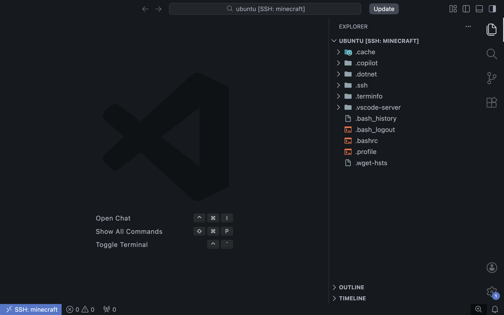

# Setting up a Docker container to run our Minecraft server

If you're unfamiliar with Docker, here's a simple explanation:

> Imagine you're developing an app on your MacOS device. Bob, who runs a Windows device, wants to use your app. Bob isn't a tech-savvy. When Bob tries to run it on his machine, it fails, maybe because he's missing some dependencies. Now Bob tells you that your app doesn't work. You can only shrug and say: "It works on my device".
> 
> Docker fixes this. You give Bob a **Docker image**, which is a bundled package containing all dependencies needed to run your app. Bob installs Docker and runs this image. Docker uses the image as a blueprint to create a **Docker container**, which is an isolated environment that runs the app exactly as it ran on your device. This might sound a lot like a virtual machine, but unlike a virtual machine, a container shares resources with the host OS, making it much more lightweight. Now the app works on Bob's device!

We are Bob. We'll be using [itzg/minecraft-server](https://hub.docker.com/r/itzg/minecraft-server), an open-source Docker image for Minecraft servers. All we have to do is download Docker on our virtual machine, set up some configuration for our server, run the image, and we're done.

## Installing Docker on the virtual machine

SSH into your virtual machine and follow the [official instructions on how to install the lastest version of Docker on Ubuntu](https://docs.docker.com/engine/install/ubuntu/#install-using-the-repository).

Run this command to give the default user `ubuntu` permission to run the `docker` command.

```
$ sudo usermod -aG docker ubuntu
$ newgrp docker
```

## Setting up a `compose.yaml` file

Instead of typing long commands to run an image, we will be using Docker Compose, where we can create a YAML configuration file with instructions on how to run our container.

For this guide, we'll be creating the configuration files on our local device first, then move them over to the virtual machine later.

Start by creating a new folder with a `compose.yaml` file inside of it. Add the following to the file:

```yaml
services:
  minecraft:
    image: itzg/minecraft-server:latest
    restart: always
    ports:
      - 25565:25565
    volumes:
      - /mnt/world-data/data:/data
    mem_limit: 8.5G
    environment:
      EULA: true
      MEMORY: 8G
      VERSION: 1.21.11
      TYPE: VANILLA # VANILLA, FABRIC, FORGE, SPIGOT, ...
      DIFFICULTY: normal # peaceful, normal, easy, hard
      MODE: survival # or creative
      VIEW_DISTANCE: 10
      SIMULATION_DISTANCE: 10
      MOTD: "My Minecraft server is working!" # Message of the day
      ENABLE_WHITELIST: true
      WHITELIST: |
        user1
        user2
        user3
      OPS: |
        user1
```

We create a service called `minecraft` that will run a Docker container containing the Minecraft server. Here's what each line is doing:

```yaml
image: itzg/minecraft-server:latest
```

This line specifies the Docker image we are using, [itzg/minecraft-server](https://hub.docker.com/r/itzg/minecraft-server). Docker automatically fetches the image from [Docker Hub](https://hub.docker.com/).

```yaml
restart: always
```

Docker will automatically restart the container if it stops unexpectedly, or when the host machine is rebooted.

```yaml
ports:
  - 25565:25565
```

By default, none of the container's ports are exposed to the host machine. We want port `25565`, Minecraft's default TCP/UDP port, to be exposed so that our container can communicate with the internet. This line exposes port `25565` on the container to port `25565` on the host machine, which is our virtual machine.

```yaml
volumes:
  - /mnt/world-data/data:/data
```

By default, files in a container are isolated from the host machine, and they vanish when a container is stopped. By mounting a volume, we link a file on the host's file system to a file on the container's file system, ensuring that data persists even if the container is deleted or recreated. Here, we mount the folder `/mnt/world-data/data` on the host to the `/data` folder in the container. Remember the block volume that we created earlier? We will be mounting the it to `/mnt/world-data` later.

Note that Docker volumes are different concepts from OCI's block volumes.

```yaml
mem_limit: 8.5G
```

This will set a limit on the amount of memory the container can allocate. Change this to 0.5 GB less than the amount you allocated for your Compute Instance. I'll explain why in a moment.

```yaml
environment:
  EULA: true
  MEMORY: 8G
  VERSION: 1.21.11
  TYPE: VANILLA # VANILLA, FABRIC, FORGE, SPIGOT, ...
  DIFFICULTY: normal # peaceful, normal, easy, hard
  MODE: survival # or creative
  VIEW_DISTANCE: 10
  SIMULATION_DISTANCE: 10
  MOTD: "My Minecraft server is working!" # Message of the day
  ENABLE_WHITELIST: true
  WHITELIST: |
    user1
    user2
    user3
  OPS: |
    user1
```

This will specify environment variables that will be passed to the container.

By setting `EULA` to true, you agree with the [Minecraft EULA](https://www.minecraft.net/en-us/eula). You must set this to true to be able to run the server.

Here, the `MEMORY` variable is set to `8G`. 8 GB of memory will be allocated to the Minecraft server. We previously set `mem_limit` to `8.5G`. This is the memory limit for the entire Docker container. Setting this to 0.5 GB more than the memory limit for the Minecraft server will ensure that Java will have some memory to work with.

Feel free to change any other variables to your liking. For more information about the environment variables you can set, check out the [itzg/minecraft-server documentation](https://docker-minecraft-server.readthedocs.io/en/latest/configuration/server-properties/).

For more information about the options you can set in a Docker compose file, check out the [Docker compose file reference](https://docs.docker.com/reference/compose-file).

## Transferring your `compose.yaml` file to your virtual machine

There are many ways you can achieve this. You can edit the files directly in VSCode using Remote-SSH. My preferred way is to set up version control, push my configuration files to a GitHub repository, then clone them on my virtual machine. But for simplicity's sake we will be using the `scp` command in this guide.

SSH into your virtual machine and create a new folder named `minecraft` in the home folder.

```
$ ssh minecraft
ubuntu@minecraft-server:~$ mkdir minecraft
ubuntu@minecraft-server:~$ ls
minecraft
```

On your device, `cd` into the folder containing the `compose.yaml` file, and run this command to copy the all contents of the current folder to the folder `~/minecraft` on the virtual machine.

```
$ scp -r * minecraft:~/minecraft/
```

SSH into your virtual machine again and check if the files are there.

```
$ ssh minecraft
ubuntu@minecraft-server:~$ ls minecraft
compose.yaml
```

## Mounting the volume to our virtual machine

We'll now configure Linux to automatically mount the OCI block volume when our virtual machine starts up.

Select your Compute Instance in the OCI dashboard. Head to the "Storage" tab and scroll down to the "Attached block volumes" section. You should see the block volume that you created. Click the three dots beside the block volume and select "iSCSI commands & information". Copy the Linux "Connect" script and paste it in your virtual machine session to connect the device to our virtual machine.

Enter this command to list all disk devices:

```
$ sudo ls /dev/sd*
/dev/sda  /dev/sda1  /dev/sda15  /dev/sdb
```

I have two devices listed here, `sda` and `sdb`.

`sda` is most probably the boot volume because it has two partitions, `sda1` and `sda15`, so `sdb` is our block volume. Use `lsblk` to confirm this.

```
$ lsblk
NAME    MAJ:MIN RM  SIZE RO TYPE MOUNTPOINT
loop0     7:0    0 48.8M  1 loop /snap/core18/2857
loop1     7:1    0   34M  1 loop /snap/oracle-cloud-agent/95
loop2     7:2    0   92M  1 loop /snap/lxd/32669
loop3     7:3    0 59.6M  1 loop /snap/core20/2585
loop4     7:4    0 44.3M  1 loop /snap/snapd/24672
sda       8:0    0 46.6G  0 disk
├─sda1    8:1    0 46.5G  0 part /
└─sda15   8:15   0   99M  0 part /boot/efi
sdb       8:16   0   50G  0 disk
```

`sdb` is the block volume because it is 50 GB, just as we specified earlier, doesn't have any partitions, and has no mount point.

Let's create a partition on our block volume with the `fdisk` utility. After entering the command, input `g` to create a new GPT table, `n` to create a new partition and enter to accept all defaults, and finally `w` to write the changes and exit.

```
$ sudo fdisk /dev/sdb

Welcome to fdisk (util-linux 2.34).
Changes will remain in memory only, until you decide to write them.
Be careful before using the write command.

Device does not contain a recognized partition table.
Created a new DOS disklabel with disk identifier 0xf8f8369f.

// [!code highlight]
Command (m for help): g
Created a new GPT disklabel (GUID: BA80CE3A-3CE8-0E48-BFE6-D5A3741D34F8).

// [!code highlight]
Command (m for help): n
Partition number (1-128, default 1):
First sector (2048-104857566, default 2048):
Last sector, +/-sectors or +/-size{K,M,G,T,P} (2048-104857566, default 104857566):

Created a new partition 1 of type 'Linux filesystem' and of size 50 GiB.

// [!code highlight]
Command (m for help): w
The partition table has been altered.
Calling ioctl() to re-read partition table.
Syncing disks.
```

You should see our new partition `sdb1` when we run `lsblk` again.

```
$ lsblk
NAME    MAJ:MIN RM  SIZE RO TYPE MOUNTPOINT
loop0     7:0    0 48.8M  1 loop /snap/core18/2857
loop1     7:1    0   34M  1 loop /snap/oracle-cloud-agent/95
loop2     7:2    0   92M  1 loop /snap/lxd/32669
loop3     7:3    0 59.6M  1 loop /snap/core20/2585
loop4     7:4    0 44.3M  1 loop /snap/snapd/24672
sda       8:0    0 46.6G  0 disk
├─sda1    8:1    0 46.5G  0 part /
└─sda15   8:15   0   99M  0 part /boot/efi
sdb       8:16   0   50G  0 disk
// [!code highlight]
└─sdb1    8:17   0   50G  0 part
```

Let's create an Ext4 filesystem on our partition and label it `world-data`.

```
$ sudo mkfs.ext4 -L world-data /dev/sdb1
mke2fs 1.45.5 (07-Jan-2020)
Discarding device blocks: done
Creating filesystem with 13106939 4k blocks and 3276800 inodes
Filesystem UUID: 81e77bdd-633a-47ec-8d96-42459bac54a4
Superblock backups stored on blocks:
        32768, 98304, 163840, 229376, 294912, 819200, 884736, 1605632, 2654208,
        4096000, 7962624, 11239424

Allocating group tables: done
Writing inode tables: done
Creating journal (65536 blocks): done
Writing superblocks and filesystem accounting information: done
```

To configure our block volume to automatically mount when we start up our virtual machine, we need to find the SCSI ID of our block volume. An SCSI ID is a persistent device name used when performing administrative operations on the device.

```
$ sudo ls -l /dev/disk/by-id
total 0
lrwxrwxrwx 1 root root  9 Apr 23 08:22 scsi-360547811cf3f4ac29d07d88e49fef7f5 -> ../../sda
lrwxrwxrwx 1 root root 10 Apr 23 08:22 scsi-360547811cf3f4ac29d07d88e49fef7f5-part1 -> ../../sda1
lrwxrwxrwx 1 root root 11 Apr 23 08:22 scsi-360547811cf3f4ac29d07d88e49fef7f5-part15 -> ../../sda15
lrwxrwxrwx 1 root root  9 Apr 24 09:29 scsi-360bbbeba62a04930ab0dde9c78f55fea -> ../../sdb
// [!code highlight]
lrwxrwxrwx 1 root root 10 Apr 24 09:29 scsi-360bbbeba62a04930ab0dde9c78f55fea-part1 -> ../../sdb1
lrwxrwxrwx 1 root root  9 Apr 23 08:22 wwn-0x60547811cf3f4ac29d07d88e49fef7f5 -> ../../sda
lrwxrwxrwx 1 root root 10 Apr 23 08:22 wwn-0x60547811cf3f4ac29d07d88e49fef7f5-part1 -> ../../sda1
lrwxrwxrwx 1 root root 11 Apr 23 08:22 wwn-0x60547811cf3f4ac29d07d88e49fef7f5-part15 -> ../../sda15
lrwxrwxrwx 1 root root  9 Apr 24 09:29 wwn-0x60bbbeba62a04930ab0dde9c78f55fea -> ../../sdb
lrwxrwxrwx 1 root root 10 Apr 24 09:29 wwn-0x60bbbeba62a04930ab0dde9c78f55fea-part1 -> ../../sdb1
```

Here, `scsi-360bbbeba62a04930ab0dde9c78f55fea-part1` is my SCSI ID. Make sure it starts with `scsi-`.

Create a mount point for our filesystem.

```
$ sudo mkdir /mnt/world-data
```

Run the following command to append a line to the `/etc/fstab` file. This will configure the OS to mount the block volume to `/mnt/world-data` automatically. Remember to replace the SCSI ID in the command with yours.

```
$ echo "/dev/disk/by-id/scsi-360bbbeba62a04930ab0dde9c78f55fea-part1 /mnt/world-data ext4 _netdev,nofail 0 2" | sudo tee -a /etc/fstab
```

Finally, run the `mount` command to mount the volumes in the `/etc/fstab` file.

```
$ sudo mount -a
```

Verify that our block volume is successfully mounted.

```
$ mount | grep /mnt
/dev/sdb1 on /mnt/world-data type ext4 (rw,relatime,stripe=256,_netdev)
```

Looks good!

## Running our Minecraft server

It's finally time to start our Minecraft server. `cd` into the folder containing the `compose.yaml` file and instruct Docker Compose to start a container, then wait for the server to start up.

```
$ docker compose up
```

Now for one last step, we need to expose port `25565` on our virtual machine to the outside world. On the OCI dashboard, go to `Networking > Virtual Cloud Networks` and select your VCN. Click on the "Security" tab and select the default security list. Click on "Security rules" and add a new ingress rule (ingress is incoming traffic).

We want all IP addresses to be able to access port `25565`, so input `0.0.0.0/0` for the Source CIDR, and `25565` for the Destination Port Range.

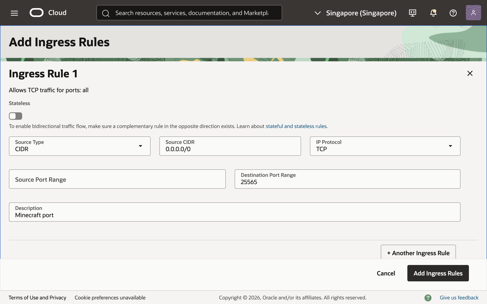

We're done! Open up Minecraft and try connecting to the server using the instance's public IP address.

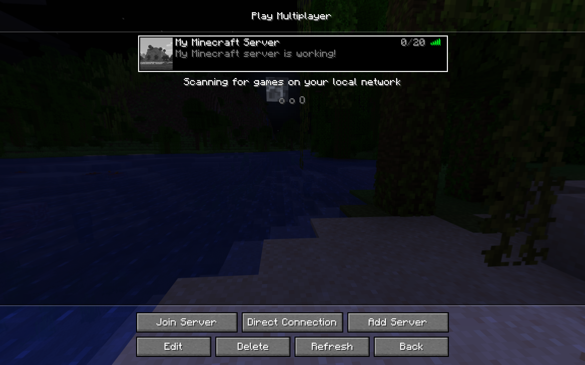

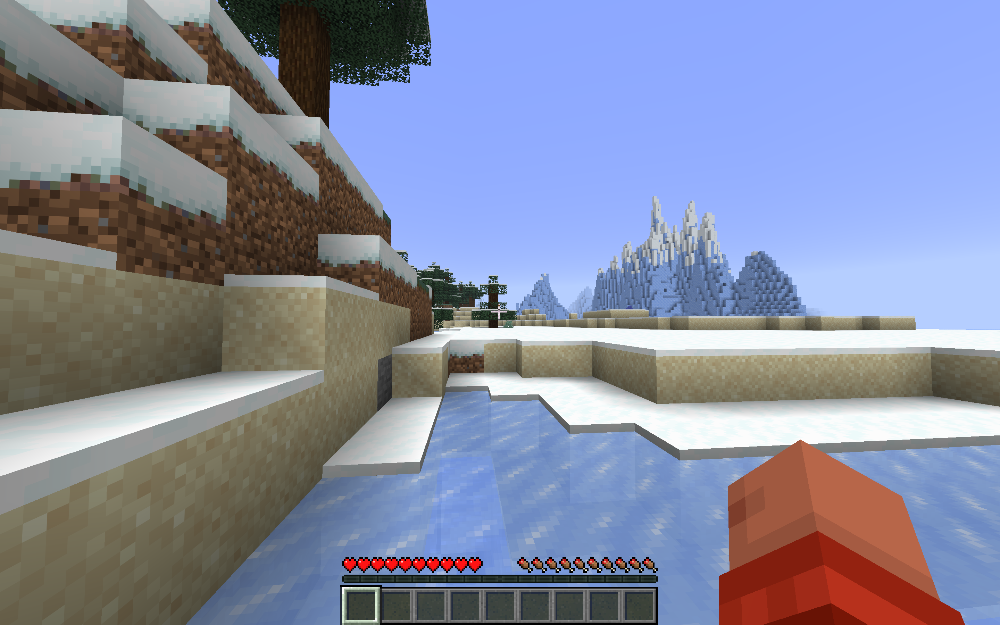

# Additional configuration

Your server is set up and ready to go, but here are some additional things you might want to do.

## Create a budget to stay within the free tier usage limits

To be absolutely sure you don't give Larry Ellison a single cent of your money, you can create a budget using the OCI Dashboard to notify you when your forecasted spend is more than $0.

Go to `Billing & Cost Management > Budgets` and create a new budget. I'll name mine "im-broke". Select your compartment, set the schedule to "Monthly" and the Budget Amount to $1, the lowest amount you can enter. Go ahead and create your budget.

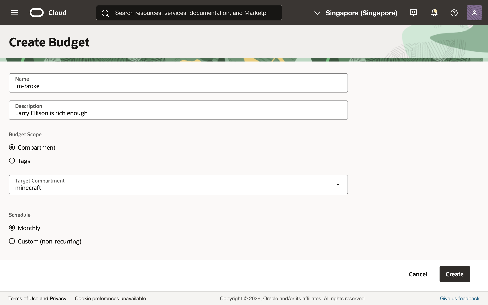

Select your newly-created budget and go to the "Budget Alert Rules" tab. Create two rules for good measure, one with the Threshold Metric set to "Actual Spend" and another set to "Forecast Spend". For both of them, set the threshold to 0.01%, the lowest value you can enter. Optionally (but recommended), add your email to receive an alert via email when the rule is triggered. Now, if you are forecasted to spend more than 0.01% of your measly $1 budget, you will be alerted.

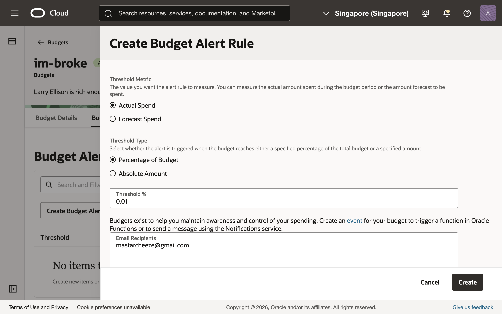

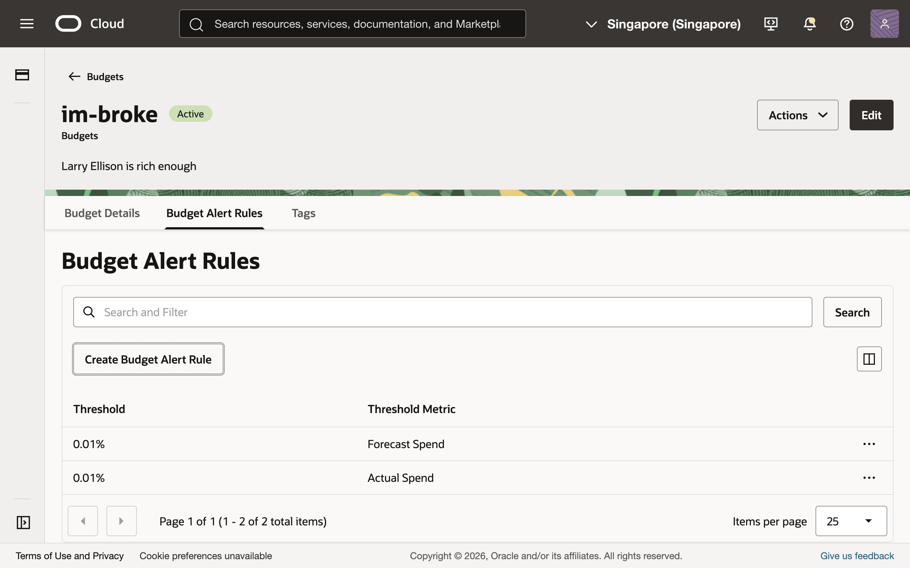

## Access the server console

To access the Minecraft server console, execute the `rcon-cli` command in the Docker container.

```
$ docker compose exec -ti minecraft rcon-cli
```

## Load an existing world

To load an existing world into the server, remove all data from the `/mnt/world-data/data/world` folder and replace it with your world data. I'm using `scp` for this. Note that you will need to change the owner of the folder to `ubuntu` in order for `scp` to work. Execute these commands on your local device.

```
$ ssh minecraft "sudo rm -r /mnt/world-data/data/world/*"
$ ssh minecraft "sudo chown -R ubuntu:ubuntu /mnt/world-data/data" 
$ scp -r ./path/to/world/folder/* minecraft:/mnt/world-data/data/world/
```

## Add mods and plugins

Let's try to install the [Carpet mod](https://modrinth.com/mod/carpet) on our Minecraft server.

Edit `compose.yaml` so that the server uses the [Fabric mod loader](https://fabricmc.net), then add the environment variable `MODRINTH_PROJECTS` to specify which mods to download from [Modrinth](https://modrinth.com/).

```yaml
environment:
  EULA: true
  MEMORY: 8G
  VERSION: 1.21.11
  // [!code --]
  TYPE: VANILLA # VANILLA, FABRIC, FORGE, SPIGOT, ...
  // [!code ++:4]
  TYPE: FABRIC # VANILLA, FABRIC, FORGE, SPIGOT, ...
  MODRINTH_PROJECTS: |
    fabric-api
    carpet
  DIFFICULTY: normal # peaceful, normal, easy, hard
  MODE: survival # or creative
  VIEW_DISTANCE: 10
  SIMULATION_DISTANCE: 10
  MOTD: "My Minecraft server is working!" # Message of the day
  ENABLE_WHITELIST: true
  WHITELIST: |
    user1
    user2
    user3
  OPS: |
    user1
```

That should be all you need. Restart the server by running `docker compose down` and `docker compose up`.

## Configure a backup policy

According to the [Oracle Always Free Resources list](https://docs.oracle.com/en-us/iaas/Content/FreeTier/freetier_topic-Always_Free_Resources.htm#:~:text=All%20tenancies%20receive%20a%20total%20of%20200%20GB%20of%20Block%20Volume%20storage%2C%20and%20five%20volume%20backups%20included%20in%20the%20Always%20Free%20resources.%20These%20amounts%20apply%20to%20both%20boot%20volumes%20and%20block%20volumes%20combined.):

> All tenancies receive a total of 200 GB of Block Volume storage, and five volume backups included in the Always Free resources. These amounts apply to both boot volumes and block volumes combined.

It may sound like the 5 backups don't count towards the 200 GB limit, but if you do some digging on Reddit, you'll find that people have been charged even when not exceeding 5 backups at a time. So backups do count towards the 200 GB free tier usage limit. Very ambiguous documentation. Very very sneaky, Larry Ellison.

If you have set your block volume storage to 50 GB, your boot volume and block volume account for 100 GB of free storage in total. This means you have 100 GB of storage leftover for backups, so at minimum you can store 2 backups of the boot volume at once.

OCI volume backups are incremental, meaning they only record the changes to the block volume between backups. This means that the total size of each backup might be smaller than the actual size. However if we stick to 2 backups, we're guaranteed to never reach the limit.

From the OCI dashboard, head to `Storage > Backup Policies`. Create a new backup policy. I'll name mine "world-data-backup". Be sure to select the correct compartment.

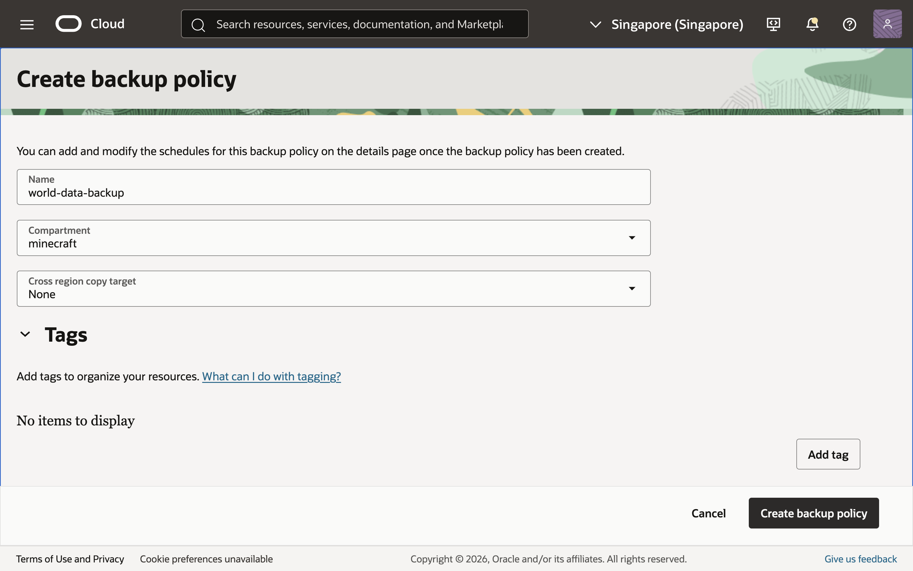

Go to the "Schedules" tab and add a schedule. I'll choose a weekly backup on Monday 00:00. Set the Retention time in Weeks to 2 so that you won't have more than 2 backups at a time.

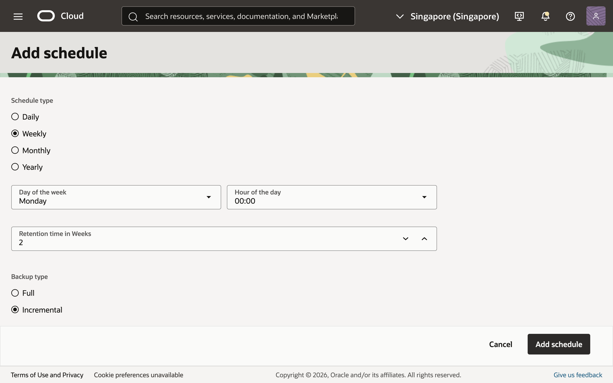

We have to specify our block volume to use the policy we just created. Head over to `Storage > Block Volumes`, select the 3 dots beside your block volume and click "Edit". Scroll down to the "Backup policies" section and select the backup policy that you just created.

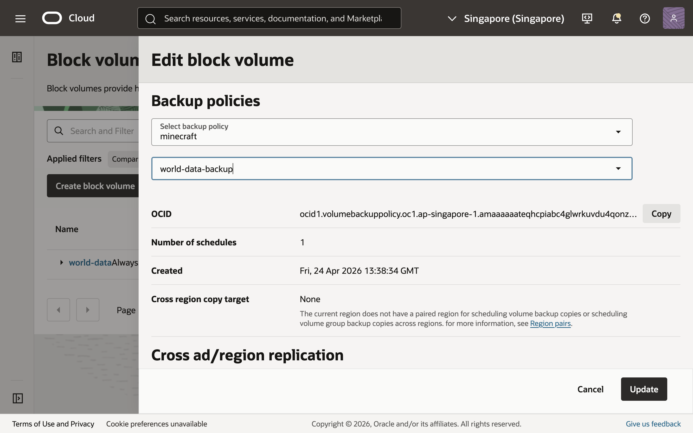

To restore a backup, go to the "Backups" tab of your block volume, click the three dots beside your backup and select "Restore block volume". This will create a new block volume. You can then manually attach it to your virtual machine, mount it, copy the files you need over to your main block volume, and delete the backup block volume.

Note that if your new block volume's attachment type is "Paravirtualized" instead of "iSCSI", you won't need to run the iSCSI connection script as we have done before.

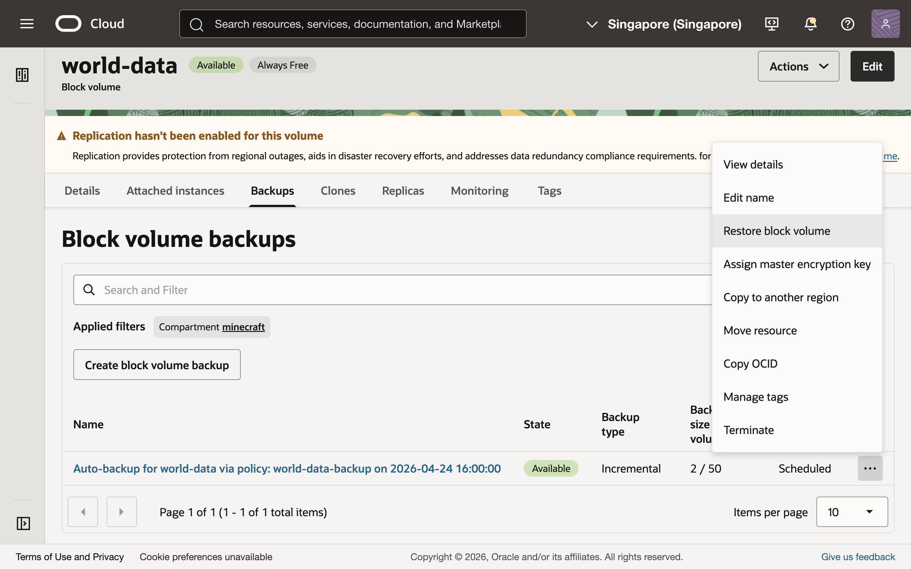

Here's a quick example of how you might do this:

```
$ sudo ls /dev/sd*
/dev/sda  /dev/sda1  /dev/sda15  /dev/sdb  /dev/sdb1  /dev/sdc  /dev/sdc1
$ sudo mkdir /mnt/world-data-restored
$ sudo mount /dev/sdc1 /mnt/world-data-restored
$ docker compose down
$ sudo rm -r /mnt/world-data/data/world/*
$ sudo cp -r /mnt/world-data-restored/data/world/* /mnt/world-data/data/world
$ sudo chown -R ubuntu:ubuntu /mnt/world-data/data/world
$ docker compose up
```

---

That concludes the guide. Stay broke and happy Minecrafting!